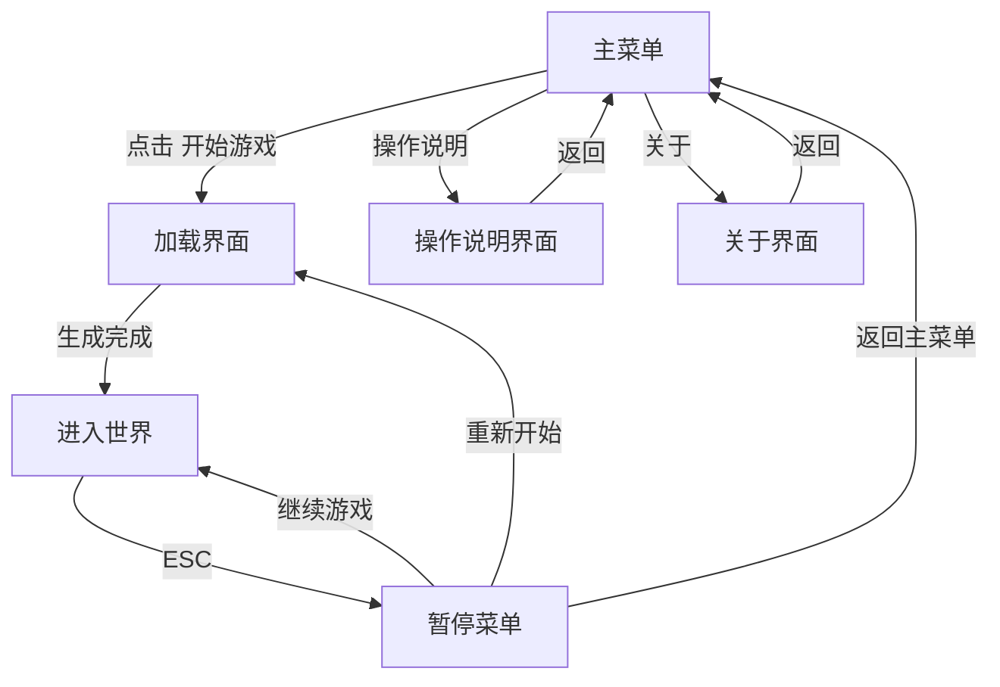

# 产品设计文档：我的世界复刻版

## 1. 产品愿景与执行摘要

### 电梯陈述

《我的世界复刻版》是一款基于 Voxel 技术的 3D 沙盒游戏，玩家将在一个由程序化算法生成的无限方块世界中自由探索、采集资源、建造建筑。游戏采用 TypeScript + Vite + THREE.js 技术栈，所有图形资源均通过代码程序化生成，无需任何外部二进制资源文件。

### 核心设计目标

| 目标 | 描述 |
|------|------|
| **沉浸式探索体验** | 程序化地形生成，每次进入世界都有全新地貌 |
| **自由创造表达** | 直观的方块放置与破坏机制，支持玩家自由构建 |
| **流畅第一人称操作** | 精准的鼠标视角控制与键盘移动，零延迟响应 |
| **纯程序化视觉** | 所有纹理、天空、光照均通过 Three.js 实时生成 |

### 核心玩法循环

## 2. 核心用户旅程

### 完整流程

### 分步旅程

**第一步：出生点生成**

玩家点击"开始游戏"后，进入加载界面，显示"正在生成世界..."及进度条。世界生成完成后，玩家出现在地表安全区域，周围是随机生成的地形——草地、树木、山丘与水域。

**第二步：第一人称控制与移动**

玩家使用 WASD 键移动，鼠标控制视角旋转（Pointer Lock 模式）。空格键跳跃，重力系统让角色始终贴地。移动时视野平滑跟随，无卡顿。

**第三步：破坏与放置方块**

- **左键**：瞄准方块后点击，方块被破坏并消失（附带粒子效果）
- **右键**：在瞄准方块的相邻空位放置当前选中的方块
- 准星对准方块时，方块表面显示半透明线框高亮

**第四步：快捷栏物品管理**

屏幕底部显示 9 格快捷栏，数字键 1-9 切换选中槽位。选中槽位有高亮边框。快捷栏包含：草方块、泥土、石头、沙子、木头、树叶、水、基岩、玻璃。

**第五步：昼夜循环**

游戏内时间自动流转，天空颜色从白天的天蓝色渐变至黄昏的橙红色，再过渡至夜晚的深蓝色。太阳与月亮的光照方向随之变化，夜晚环境变暗但仍有月光照明。

**第六步：世界探索**

地形包含草地、泥土、石头、沙子、水域与树木。玩家可以自由行走、跳跃、攀爬地形，探索程序化生成的地貌。

## 3. 功能特性分解

### 3.1 导航与主界面

#### 主菜单

- 标题：**我的世界复刻版**（居中大号字体）
- 三个按钮（垂直排列）：
  - **开始游戏** → 进入加载界面
  - **操作说明** → 显示操作说明界面
  - **关于** → 显示关于界面
- 背景：程序化生成的缓慢旋转方块场景（暗色基调）

#### 操作说明界面

- 标题：**操作说明**
- 控制列表（表格形式）：
  | 按键 | 功能 |
  |------|------|
  | WASD | 移动 |
  | 空格 | 跳跃 |
  | 鼠标 | 视角 |
  | 左键 | 破坏方块 |
  | 右键 | 放置方块 |
  | 1-9 | 选择快捷栏 |
  | E | 打开背包（预留） |
  | ESC | 暂停 |
- 底部"返回"按钮

#### 关于界面

- 标题：**关于**
- 内容：项目名称、技术栈（TypeScript + Vite + THREE.js + Voxel）、版本号、版权信息
- 底部"返回"按钮

### 3.2 游戏内 HUD

#### 准星

- 屏幕正中央显示白色"+"字形准星
- 准星对准可交互方块时轻微放大（1.2x）

#### 快捷栏

- 屏幕底部居中，9 个等宽槽位
- 每个槽位显示方块图标（程序化生成的纹理预览）
- 选中槽位：白色高亮边框 + 轻微放大
- 未选中槽位：半透明灰色边框
- 数字键 1-9 快速切换

#### 方块高亮

- 准星对准方块时，该方块表面叠加半透明白色线框
- 线框厚度 2px，透明度 60%
- 距离超过 8 格时不再显示

### 3.3 核心交互机制

#### 方块破坏

- 左键点击：立即破坏（创造模式，无延迟）
- 破坏时播放粒子效果（方块颜色的小立方体四散）
- 破坏后方块消失，该位置变为空气

#### 方块放置

- 右键点击：在瞄准方块的相邻面放置当前选中方块
- 放置位置必须为空（空气）或可替换（水）
- 不能放置在玩家自身所在位置
- 放置时方块有轻微缩放动画（0.8x → 1.0x，200ms）

#### 世界生成

- 基于噪声算法的程序化地形生成
- 地形高度变化：平原、丘陵、山脉
- 地表覆盖：草地（绿色）、沙子（靠近水域）、石头（高山）
- 树木随机生成在草地表面
- 水域生成在低洼区域
- 世界边界：以玩家出生点为中心 128x128 区块范围

### 3.4 方块类型

| 方块 | 特征 |
|------|------|
| 草方块 | 顶部绿色、侧面棕色+绿色条纹 |
| 泥土 | 均匀棕色纹理 |
| 石头 | 灰色颗粒纹理 |
| 沙子 | 淡黄色颗粒纹理 |
| 木头 | 棕色竖条纹（树皮纹理） |
| 树叶 | 绿色半透明纹理 |
| 水 | 蓝色半透明，可穿过 |
| 基岩 | 深灰色，不可破坏 |
| 玻璃 | 透明，可透视 |

### 3.5 物理与碰撞

- **重力**：玩家持续受重力影响，直到落在方块表面
- **跳跃**：空格键触发，跳跃高度 1.25 格
- **碰撞检测**：玩家碰撞体为 0.6x1.8x0.6 格（宽x高x深）
- **水交互**：玩家可走入水中，移动速度降低 50%，可正常跳跃
- **边界**：世界底部为基岩层，不可破坏

### 3.6 昼夜循环

- 完整周期：10 分钟（600 秒）
- 白天（0-5 分钟）：天空蓝色，阳光充足
- 黄昏（5-6 分钟）：天空渐变为橙红色
- 夜晚（6-9 分钟）：天空深蓝色，月光微弱
- 黎明（9-10 分钟）：天空渐变为淡蓝色
- 光照强度随太阳位置平滑变化

## 4. 视觉打磨标准

### 程序化纹理

- 所有方块纹理通过 Three.js `CanvasTexture` 实时生成
- 每种方块生成 16x16 像素纹理，带噪点与颜色变化
- 草方块：顶部与侧面使用不同纹理（顶部绿色、侧面棕色+绿色边缘）

### 光照系统

- **方向光**：模拟太阳，随昼夜循环旋转
- **环境光**：恒定微弱补光，确保夜晚可见
- **方块光照**：相邻方块间无光照传播（简化处理）

### 天空渲染

- 使用渐变天空球（ShaderMaterial）
- 颜色随昼夜循环平滑过渡
- 太阳与月亮使用简单的圆形光晕

### 雾效

- 启用距离雾，雾色与天空颜色同步变化
- 雾起始距离 60 格，结束距离 120 格
- 提升氛围感并优化远处渲染性能

### 粒子效果

- 方块破坏：生成 8-12 个小立方体粒子，颜色取自方块纹理
- 粒子受重力影响，0.5 秒后消失
- 粒子数量限制：同时最多 200 个

## 5. UI 流程与精确文本

### 界面文本清单

| 界面 | 文本内容 |
|------|----------|
| 主菜单标题 | 我的世界复刻版 |
| 主菜单按钮 | 开始游戏 / 操作说明 / 关于 |
| 加载界面 | 正在生成世界... |
| 暂停菜单标题 | 游戏暂停 |
| 暂停菜单按钮 | 继续游戏 / 重新开始 / 返回主菜单 |
| 操作说明标题 | 操作说明 |
| 关于标题 | 关于 |

### 状态转换规则

| 当前状态 | 触发条件 | 目标状态 |
|----------|----------|----------|
| 主菜单 | 点击"开始游戏" | 加载界面 |
| 加载界面 | 世界生成完成 | 游戏中 |
| 游戏中 | 按 ESC | 暂停菜单 |
| 暂停菜单 | 点击"继续游戏" | 游戏中 |
| 暂停菜单 | 点击"重新开始" | 加载界面 |
| 暂停菜单 | 点击"返回主菜单" | 主菜单 |
| 操作说明 | 点击"返回" | 主菜单 |
| 关于 | 点击"返回" | 主菜单 |

### 交互反馈规则

- 所有按钮悬停时高亮（亮度提升 20%）
- 按钮点击时有轻微缩放反馈（0.95x）
- 暂停时释放鼠标指针锁定，恢复时重新锁定
- 窗口大小变化时，渲染画面自动适配（保持宽高比）

## 6. 范围边界

### 范围内（v1 版本）

- 单人游戏（创造/生存简化模式）
- 程序化地形生成（噪声算法）
- 方块破坏与放置
- 9 格快捷栏（无背包系统）
- 昼夜循环与天空变化
- 第一人称控制（WASD + 鼠标）
- 基础物理（重力、跳跃、碰撞）
- 程序化纹理与视觉效果
- 主菜单 / 暂停 / 加载界面

### 范围外（严格排除）

| 功能 | 说明 |
|------|------|
| 多人游戏 | 无网络功能 |
| 红石电路 | 无逻辑电路系统 |
| 生物/AI 敌人 | 无动物、怪物、NPC |
| 合成系统 | 无工作台、配方 |
| 饥饿/生命值 | 无生存数值系统 |
| 音效/音乐 | 无任何音频 |
| Mod 支持 | 无插件/模组 API |
| 存档/读档 | 无世界保存功能 |
| 背包系统 | 仅快捷栏，无 E 键背包 |
| 二进制资源 | 无 PNG/JPG/WAV/MP3 文件 |

## 7. 附加 UX 细节

### 加载界面

- 显示"正在生成世界..."文字
- 进度条从 0% 到 100% 平滑填充
- 背景为深色渐变 + 旋转的方块剪影
- 生成完成后自动进入游戏

### 方块高亮线框

- 准星对准方块时显示
- 半透明白色线框，厚度 2px
- 距离超过 8 格自动隐藏

### 破坏动画

- 方块被破坏时，表面短暂显示裂纹纹理（4 帧，每帧 50ms）
- 随后方块消失并播放粒子效果
- 总破坏动画时长 200ms

### 相机过渡

- 进入游戏时，相机从高空平滑下降至玩家位置（1 秒）
- 暂停/恢复时，视野无跳变
- 窗口 resize 时，相机 FOV 与宽高比自动调整

### 响应式设计

- 支持不同窗口尺寸（最小 800x600）
- HUD 元素按比例缩放
- 快捷栏在窄窗口下自动缩小但保持 9 格